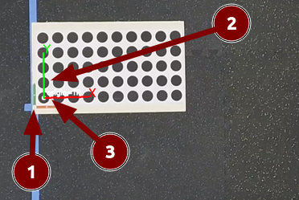
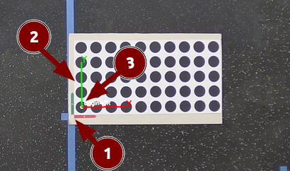

# Calibration Process

End-to-end procedure for calibrating a Lorex-camera tracking rig from scratch.
Three core phases (intrinsics, homography, cross-camera alignment),
one mandatory verification phase (wall-flush), plus one optional
quantitative-validation phase (plank). A sixth phase, using the plank
as the calibration *source* rather than just a checker, is documented
at the end but currently deferred.

Phase 1 only needs to be redone when the lens or sensor changes;
phases 2-3 must be redone any time a camera is physically moved.
Phase 4 (and ideally Phase 5) should be run any time calibration is
touched.

All scripts live in `PyLorex/PyLorex/`. Edit the `camera_name` constant at
the top of each script and run once per camera (`'tiger'`, then `'shark'`).

## Phase 1: Intrinsic Calibration (per camera)

Solves for the camera matrix `K` and lens distortion coefficients
`dist`. These are properties of the lens + sensor and do not change when
the camera body is moved.

### 1a. Collect images

```
PyLorex/PyLorex/script_collect_intrinsic_images.py
```

- Set `camera_name`.
- Captures `number_of_images` (default 15) RTSP frames, with a beep
  between shots.
- Between shots, **physically move and tilt the calibration dot pattern
  through the camera's view**: vary position (corners, centre, edges),
  distance (close/far), and tilt (rotate, slant). Variety matters far
  more than the count — 15 well-varied frames beat 50 near-identical
  ones.
- The board does **not** need to be on or near the floor for
  intrinsics — hold it anywhere it's clearly visible and in focus.
  The math here only needs the pattern's geometry, not its absolute
  position. (The floor constraint applies only in Phase 2, where the
  board defines the world frame's z = 0 plane.)
- Output: `Calibration/<camera>/calibration_images/frameNN.jpg`.

### 1b. Solve intrinsics

```
PyLorex/PyLorex/script_run_intrinsic_dots.py
```

- Set `camera_name`. Optional: bump `visual_check_ms` (default 1000) if
  you want longer per-image inspection during detection.
- Detects the circle grid in each image, runs `cv.calibrateCamera`,
  writes the result to `Calibration/<camera>/Results/intrinsics.yml`.
- Annotated detection PNGs are written to
  `Calibration/<camera>/Results/detect_vis/` for offline review.

**Acceptance criteria:**

- At least ~10 of the 15 frames should produce a valid grid detection.
- Final **RMS reprojection error**:
  - `< 0.5 px` → good.
  - `0.5 – 1.0 px` → acceptable; usable but not great.
  - `> 1.0 px` → poor coverage or noisy frames; recapture with more
    pose variety and rerun.
- The "Worst per-image errors (top 5)" list flags individual problem
  frames. If one frame's error is much higher than the others, look at
  its `vis_NNN.png` — usually the grid is partially occluded or
  the board was nearly edge-on.

### 1c. Validate intrinsics

```
PyLorex/PyLorex/script_assess_intrinsics.py
```

- Runs additional sanity checks on the saved intrinsics and writes
  diagnostic plots/images.

## Phase 2: Homography Calibration (per camera)

Solves for the camera's pose in the world frame: rotation `R_pnp`,
translation `t_pnp`, plus rectifying homographies `H_raw` (raw frame
→ board mm) and `H_undistorted` (undistorted frame → board mm).

**Precondition:** valid intrinsics from Phase 1.

### 2a. Place the calibration board

- Lay the calibration dot board flat on the floor inside the arena.
- **The board's position and orientation in the room defines the world
  frame's origin and axes for that camera.** Pick a spot you can
  recover later — taping the board outline onto the floor makes
  reproducing the placement trivial if the calibration has to be
  redone.
- **Place the board origin on the inter-camera reference line** —
  the physical line on the floor (typically blue tape) connecting
  the two cameras' nadir points. This makes the cross-camera offset
  in Phase 3 a pure translation along one axis rather than a 2-axis
  offset, which keeps the `shark2tiger_delta` model simple.
  - The constraint is "on the line", not "at the image centre". The
    position *along* the line is a free choice — place each camera's
    board roughly under that camera's nadir (best image-centre
    resolution, lowest distortion). The two boards will end up at
    different points on the line, separated by the inter-camera
    distance, which becomes `shark2tiger_delta_y` in Phase 3.
- **Verify the board's physical x/y axes match the axes the
  calibration software reports.** When the homography script runs, it
  overlays the detected board axes on the image (green for one axis,
  red for the other). Those overlay arrows must point in the
  directions you physically labelled +x and +y on the board.
  Otherwise the world frame is rotated 90° / 180° / 270° from your
  intent, and every downstream coordinate is silently mis-aligned.

| Origin on the reference line | Software axes match the physical board axes |
|---|---|
|  |  |

In both images: callout (1) marks the board origin sitting on the
blue floor line; callouts (2) and (3) mark the green/red software
overlay arrows that must match the board's physical +y and +x.

- For multi-camera setups (`tiger` + `shark`), see Phase 3 below for
  the parallel-axes precondition.

### 2b. Run the homography solver

```
PyLorex/PyLorex/script_run_homography.py
```

- Set `camera_name`.
- Set `origin_preset` (default `"TR"`) to choose which corner of the
  detected grid maps to the board's origin. Keep this consistent
  across cameras unless you have a specific reason not to.
- Captures a single frame from the camera, detects the dot grid,
  solves PnP, and saves:
  - `Calibration/Results/pose_<camera>.npz`
  - `Calibration/Results/pose_<camera>.json`
- Both files contain `K_scaled`, `dist`, `R_pnp`, `t_pnp`, `H_raw`,
  `H_undistorted`, plus debug fields.

**Acceptance criteria:**

- The script prints the camera-to-board distance from PnP
  (`distance to board (mm)`). Sanity-check it against your tape
  measure to the floor — should agree to a few mm.
- Reprojection error is printed. Should be a fraction of a px for a
  static board.

## Phase 3: Cross-Camera Alignment

When two or more cameras cover the arena, one is designated reference
(by convention: `tiger`) and the others are translated into the
reference's frame at runtime.

> **Building the calibration panels themselves** — the physical dot
> board, the floor reference line, and the inter-camera setup — is
> documented separately on the Notion *Lorex Camera System* page (it
> needs photos of the construction that aren't mirrored here).

**Precondition for the simple translation-only model:** both
calibration boards must be placed with **parallel axes** (same
orientation in the room). If they're rotated relative to each other,
`shark2tiger_delta` cannot capture the rotation and `shark` data will
land in the unified frame with the wrong heading.

If the cameras cannot both see the same physical board (e.g. cameras
far apart), use two boards laid with the same orientation, and use a
tape measure to establish the offset between their two origins.

### 3a. Set per-camera nadir + inter-camera distance

```
PyLorex/PyLorex/script_set_camera_center.py
```

This is the **plumb-line bypass** of PnP for the cross-camera
alignment — measuring with a tape and clicking in the stitched arena
image is more accurate than relying on PnP's translation `t` from
single-z-plane data.

The script:

- For each camera, prompts for the tape-measured `Cz` (camera height
  above the floor, in mm), captured via plumb line.
- Opens a stitched view of both cameras and asks you to click each
  camera's nadir (the spot on the floor directly under its lens).
- Prompts for the **floor-plane distance between the two nadirs** (in
  mm), as measured by tape on the floor between the plumb-line marks.
- Writes:
  - `Calibration/Results/c_measured_<camera>.json` (per-camera nadir
    in world coordinates),
  - `Calibration/Results/camera_system.json` (the derived
    `shark2tiger_delta_{x,y}`).

### 3b. Settings.py reads camera_system.json at import

`PyLorex/LorexLib/Settings.py` reads `camera_system.json` at module
import and exposes:

```python
LorexSettings.shark2tiger_delta_x   # mm
LorexSettings.shark2tiger_delta_y   # mm
```

These are read at runtime by `ServerClient.get_trackers`, so any
process started after Phase 3a will pick the new deltas up
automatically — no manual `Settings.py` edit needed.

## Phase 4: Verification

Quick end-to-end check that the calibration produces honest tracking.

1. **Restart the PyLorex tracking server** so it loads the new pose
   bundles and the new `shark2tiger_delta` values.
2. **Take a fresh environment snapshot** from the 3PiRobot side:
   `Control_code/SCRIPT_TakeEnvSnapshot.py`. Open the resulting
   `arena_tiger.png` / `arena_shark.png` and confirm the arena's foam
   wall structure is visible with margin around it. (If the wall is
   clipped or sits at the image edge, the cameras need to be
   physically re-aimed before continuing.)
3. **Quick wall-flush + cross-camera check** with
   `PyLorex/PyLorex/script_capture_wall_probe.py`. Drive the robot
   flush against several walls and trigger an auto-capture at each
   stop. The script reports a **per-camera bias** for each capture:

   ```
   bias = (tracker-distance-to-nearest-wall-point) − 48 mm
   ```

   (48 mm = robot radius, so 0 means the tracker has the robot
   exactly flush against the nearest wall.) Acceptance band today is
   `|bias| ≲ 75 mm` on the current calibration. When the robot is
   visible to both cameras simultaneously, the **difference between
   the two cameras' biases** at the same physical pose is also the
   cross-camera agreement number — a large consistent offset means
   `shark2tiger_delta_{x,y}` needs redoing (Phase 3); a
   position-dependent disagreement points to one camera's
   extrinsics. (Requires arena geometry to be built — see below.)

If all checks pass, the calibration chain is healthy. Then proceed
with:

- Re-annotate the new arena snapshot (green polylines along the foam
  top edge — see arena geometry docs).
- Re-run `Control_code/SCRIPT_BuildArenaGeometry.py` to regenerate
  `arena_features.npz`.
- Resume acquisitions / policy training.

## Phase 5: Quantitative validation via plank (optional but recommended)

Phase 4 answers "is the calibration usable?" (flush-against-wall
biases stay in a sane band). Phase 5 answers "**how accurate is the
tracker right now**?" as a number, anywhere in the arena, without
needing accurate wall annotation.

**Plank**: a rigid bar with three ArUco markers at known offsets
along its length:

| marker id | offset along plank (mm) |
|---|---|
| 75 | −500 |
| 76 |    0 |
| 77 | +500 |

so the pairwise distances are `(75, 76) = (76, 77) = 500 mm`,
`(75, 77) = 1000 mm`. These distances are the ground truth.

### 5a. Capture plank snapshots

```
PyLorex/PyLorex/script_capture_plank.py
```

- Place the plank flat on the floor (markers facing up) inside the
  arena.
- Auto-capture is enabled: hold the plank still for ~2 s and the
  script grabs a median-of-N frames per camera.
- Move the plank to a new position/rotation between captures —
  variety matters far more than count. Aim for ~10 captures spanning
  near + far corners, both cameras' nadirs, and at least one
  rotation per camera.
- Output: `Calibration/PlankSnapshots/<session>/snapshot_NNN/`
  containing `frame_*.jpg` and `detections.json`.

### 5b. Diagnose

```
PyLorex/PyLorex/script_diagnose_plank.py
```

- Defaults to the most recent session under
  `Calibration/PlankSnapshots/`.
- For every snapshot and every camera that saw all three markers,
  projects the marker centres into the world plane at
  `PLANK_Z_MM = 25 mm` (the plank surface height) using ray-plane
  intersection with the current calibration, then computes the three
  pairwise distances and compares to ground truth.

**Healthy baseline today** (current calibration, this arena):

- mean residual: **≈ +1.5 mm** (essentially unbiased)
- std: **≈ 25 mm**
- worst case: **≈ 90 mm**, typically at the far corner of one
  camera's view (largest off-axis angle, most sensitive to small
  pose errors).

Anything substantially worse than that (e.g. std > 50 mm) is a
signal that the pose bundles or `shark2tiger_delta` have drifted —
recalibrate.

## Phase 6 (deferred): Plank as the calibration *source*

The same plank captures can in principle drive a **bundle
adjustment** that refines `K, dist, R, t` for both cameras jointly —
an attractive alternative to the current dot-board + PnP +
plumb-line pipeline because:

- one easy-to-handle plank replaces a large flat dot board on the
  floor,
- the same captures used for *checking* the calibration also drive
  *fitting* it,
- the bundle's residuals naturally weight near + far data through
  the loss, instead of relying on a board sitting on the floor at
  one z.

A working bundle-fit script exists at
`PyLorex/PyLorex/script_calibrate_plank.py` and produces an
internally consistent `pose_*`, `c_measured_*`, `camera_system.json`
set with a few-mm residual when used end-to-end.

**Why this is held back as deferred:** adoption is blocked by
`Environment.py`'s warp pipeline, which still uses `H_raw` (the
homography rectified from the dot-board PnP) to build the stitched
arena image. After bundle calibration, the runtime tracker
(ray-plane in `LorexLib/Lorex.get_aruco`) and the warp/build-geom
side (`H_raw + λ` formula in `Control_code/SCRIPT_BuildArenaGeometry.py`)
end up in *different* frames at the periphery, and arena features no
longer overlay the actual walls. Promoting the plank bundle to
production requires refactoring the warp / build-geom path to use
the same ray-plane projection as the tracker, so that all consumers
share one frame.

Until that refactor lands, treat Phase 6 as a research path, not a
calibration option for production runs.

## Notes

- The marker-height bias correction in `LorexLib/Lorex.py` relies on
  `R_pnp, t_pnp` and `Settings.marker_height_mm`. As long as the
  marker is physically mounted at the assumed height (150 mm by
  default), it produces correct marker `(X, Y)` automatically after
  a fresh calibration.
- `aruco_yaw_offset_deg` and `aruco_forward_axis` in
  `LorexLib/Settings.py` are implicitly calibrated against the
  marker's mounting on the robot, not against the camera pose. They
  do not need to change when the cameras move (only if the marker
  itself is remounted with a different orientation on the robot).
